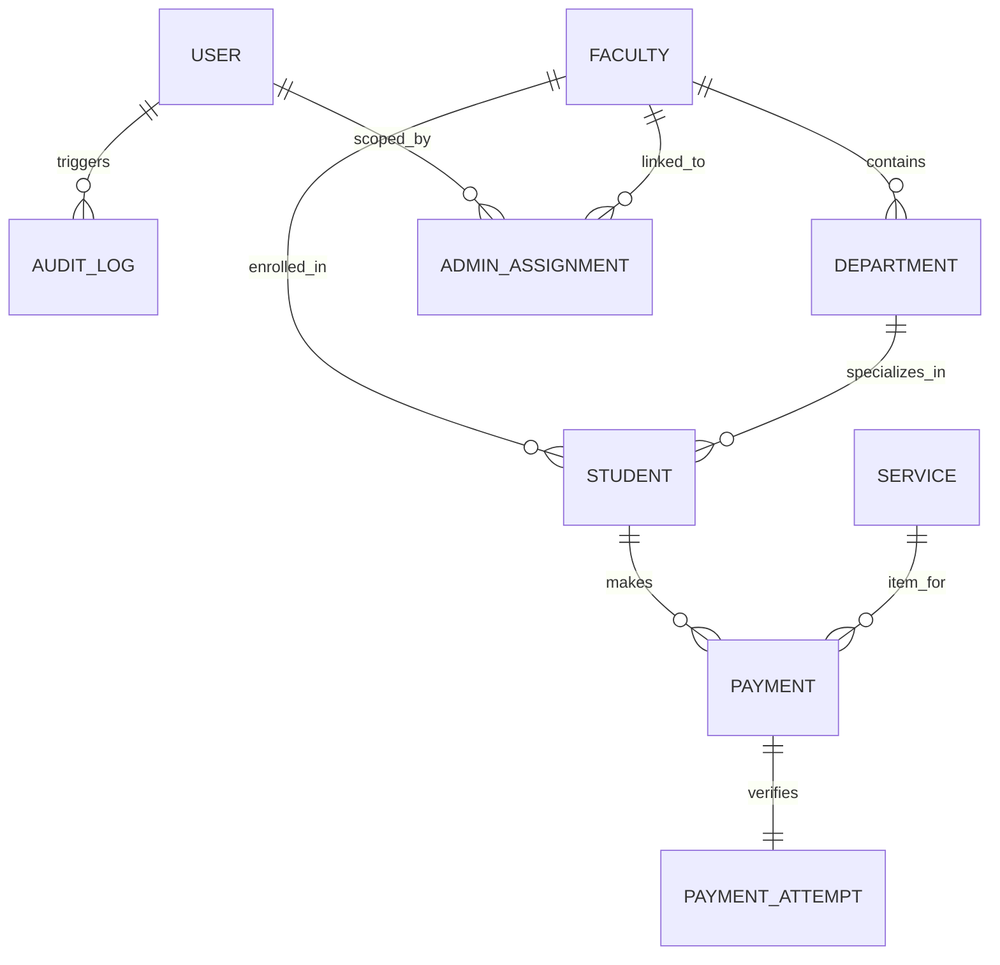

# التوثيق الشامل لنظام إدارة شؤون الطلاب والمدفوعات (Student Information System - SIS)

مرحباً بك في مستند التوثيق الفني والتشغيلي لنظام **SIS**. يهدف هذا النظام إلى رقمنة وإدارة شؤون الطلاب، الخدمات الأكاديمية، والعمليات المالية والمدفوعات بكفاءة وحوكمة كاملة.

---

## 📌 1. بنية وتصميم النظام (System Architecture)

يعتمد النظام على نمط **MVC (Model-View-Controller)** القائم على إطار العمل **Laravel**، مع واجهات تفاعلية مبنية باستخدام **Blade Template Engine** و**Vanilla CSS / Tailwind**، وقاعدة بيانات **MySQL** لضمان الكفاءة والأمان.

### 👥 الأدوار والصلاحيات (Authentication & Roles)
يحتوي النظام على بوابتي تسجيل دخول منفصلتين بالكامل لحماية الخصوصية والأمن:
1. **بوابة الطلاب (Student Portal):** يتم التحقق من هوية الطالب عبر الرقم المرجعي أو الكود الجامعي ورقم الهوية.
2. **بوابة الموظفين (Employee Portal):** تدعم عدة أدوار وصلاحيات (Multi-Role Authentication):
   * **Super Admin & Admin (مدير النظام):** يمتلك كامل الصلاحيات لإدارة الموظفين، الإعدادات، الكليات، الخدمات، ومراقبة التقارير المالية والرقابية.
   * **Student Affairs (شؤون الطلاب):** إدارة ملفات الطلاب، استيراد الطلاب من ملفات إكسيل، والتسجيل اليدوي للمدفوعات النقدية.
   * **Financial Affairs (الشؤون المالية):** مراجعة التسوية المالية اليومية، تصفح التقارير المتقدمة، وتصدير البيانات المالية.
   * **Graduate Affairs (شؤون الخريجين):** صلاحيات مخصصة لإدارة خريجي الكليات وخدماتهم.

### 🛡️ الصلاحيات الدقيقة وتحديد النطاق (Fine-grained Permissions & Scoping)
* **نظام الصلاحيات المخصصة (Permissions):** إمكانية إسناد صلاحيات إضافية محددة للموظف مباشرة من لوحة الإدارة.
* **تحديد النطاق الأكاديمي (Faculty Scope / Admin Assignment):** يمكن للإدارة تحديد نطاق عمل الموظف (مثال: موظف شؤون طلاب في كلية الهندسة فقط). النظام يمنع هذا الموظف تلقائياً من تصفح أو تعديل بيانات أي طالب مسجل في كلية أخرى.

---

## 💾 2. هيكل قاعدة البيانات والموديلات (Database Schema & Models)

يتكون النظام من مجموعة من الجداول المترابطة وعلاقات (Eloquent Relationships) كالتالي:



### الموديلات الرئيسية (Models):
1. **Student (الطالب):**
   * يحفظ بيانات الطالب: الاسم، الرقم القومي (`national_id`)، الكود الجامعي (`reference_number`)، الفرقة الدراسية، الكلية والكلية التخصصية، القسم الأكاديمي.
   * يرتبط بعلاقة "ينتمي إلى" (`belongsTo`) مع الكلية (`Faculty`) والقسم (`Department`)، وعلاقة "لديه العديد" (`hasMany`) مع المدفوعات (`Payment`).
2. **Payment (العمليات المالية):**
   * يسجل حركات الدفع: القيمة، الرقم المرجعي للعملية، الخدمة المدفوعة، الطالب، تاريخ الدفع، حالة الدفع (`status`: معلق، ناجح، مرتجع، إلخ).
3. **Service (الخدمات والرسوم):**
   * الخدمات المتاحة للطلاب (مثل شهادة القيد، المظاريف، الرسوم المقررة).
   * تحتوي على حقل `sub_options` (مخزن كـ JSON لتخزين خيارات الخدمة الفرعية) و`requires_subject` لمعرفة ما إذا كانت الخدمة تحتاج لتحديد مادة.
4. **Faculty & Department (الكليات والأقسام):**
   * لإدارة الهيكل الأكاديمي داخل الجامعة/المعهد.
5. **User (الموظفين):**
   * بيانات حسابات الموظفين، الدور المالي والإداري (`role`)، وحالة النشاط (`is_active`).
6. **AuditLog (سجل النشاط الرقابي):**
   * يسجل نشاط الموظفين داخل لوحة التحكم (الحدث، اسم الجدول المتأثر، المستخدم المسؤول، الـ IP، التاريخ).
7. **Discount (الخصومات والمنح):**
   * لإعداد وإدارة الخصومات المفروضة على مصروفات الطلاب (مثل منح التفوق، خصم أبناء العاملين).
8. **TuitionConfig (إعدادات الرسوم الدراسية):**
   * لتهيئة الرسوم الدراسية الإلزامية لكل فرقة دراسية أو كلية.

---

## 🚀 3. بوابات ومميزات النظام بالتفصيل (System Portals & Features)

### 3.1 بوابة الطالب (Student Portal)
بوابة مخصصة للخدمات الذاتية للطلاب وتضم:
* **لوحة التحكم (Dashboard):** عرض حالة الطالب الدراسية والمالية بلمحة سريعة.
* **المصروفات الدراسية (Tuition):** استعراض المصروفات المستحقة للفصل الدراسي الحالي وإمكانية دفعها مباشرة.
* **دفع الخدمات والـ Checkout:** تصفح كافة الخدمات المتاحة وتكاليفها، وإدخال الخيارات الفرعية أو اسم المادة، والانتقال لواجهة الدفع الآمن.
* **سجل المعاملات والإيصالات الرقمية:** استعراض تاريخ المدفوعات السابق، وتحميل الإيصال الرقمي الرسمي لكل عملية للدلالة على السداد.
* **الدعم الفني والدردشة الذكية (AI Chatbot):** مساعد فوري متاح للطالب لمساعدته في الاستفسار عن الخطوات وطريقة السداد.

### 3.2 بوابة شؤون الطلاب (Student Affairs)
بوابة تخدم الجانب الإداري والتسجيلي للطلاب وتضم:
* **إدارة الطلاب:** استعراض الطلاب والبحث الذكي بالاسم أو الكود.
* **إضافة طالب جديد:** واجهة لإدخال بيانات الطلاب يدوياً.
* **استيراد الطلاب الجماعي (Excel/CSV Import):** رفع ملف Excel/CSV يحتوي على بيانات مئات الطلاب ليتم تسجيلهم وتوليد حساباتهم دفعة واحدة، مع إمكانية تحميل قالب إرشادي جاهز.
* **الدفع النقدي اليدوي (Manual Payment):** تسجيل المبالغ التي يدفعها الطالب يدوياً في الخزينة وتوليد إيصال فوري له داخل النظام.

### 3.3 بوابة الشؤون المالية (Financial Affairs)
بوابة رقابية ومالية لمتابعة الإيرادات وتضم:
* **التسوية اليومية (Daily Settlement):** شاشة تظهر كافة العمليات الناجحة والمدفوعة خلال اليوم الجاري لتسهيل عملية مطابقة الخزائن والبنك.
* **تقارير المدفوعات المتقدمة:** فلترة الحسابات حسب الخدمة، الكلية، الحالة الأكاديمية، نطاق تاريخ معين، أو الرقم المرجعي.
* **تصدير التقارير (Data Export):** تصدير كشوف المدفوعات اليومية والتقارير المالية بصيغة Excel لتقديمها للإدارات العليا.

### 3.4 بوابة الإدارة العامة (Admin Portal)
بوابة المراقبة والتحكم الشاملة في النظام وتضم:
* **إدارة الموظفين والPermissions:** إضافة وتعديل وحذف حسابات الموظفين وتخصيص صلاحياتهم ونطاق عملهم الأكاديمي (كلية معينة).
* **إدارة الكليات والأقسام الأكاديمية:** تهيئة وإضافة الكليات والأقسام وتفعيلها أو إيقافها.
* **إدارة الخدمات ورسومها:** لوحة تحكم كاملة للتحكم في تكاليف الخدمات والخيارات المتاحة لكل خدمة وتفعيلها/تعطيلها.
* **إدارة الخصومات والمنح:** تهيئة الخصومات وتحديد نسبتها ليتم تطبيقها على مستحقات الطلاب.
* **إدارة المصروفات الدراسية الإلزامية (Tuition Configuration):** تهيئة المصاريف السنوية الثابتة للطلاب بناءً على كلياتهم.
* **إدارة المرتجعات (Refund Workflow):** طابور مالي لمعالجة طلبات استرداد الأموال (Refund Request) والموافقة عليها أو رفضها وإلغاء العمليات المالية ذات الصلة.
* **طابور مراجعة المعاملات المعلقة (Pending Review):** للمراجعة اليدوية للمدفوعات التي تحتاج لتأكيد أو تسوية للتحول إلى حالة "مدفوعة ناجحة".
* **إحصائيات تفاعلية (Interactive Statistics):** تقارير مرئية ورسوم بيانية توضح نسب التحصيل، الإيرادات الكلية، وتفصيل المعاملات لكل كلية على حدة.
* **سجل الرقابة والأمان (Audit Log):** سجل غير قابل للتعديل يوثق نشاط كل موظف على النظام بالثانية والـ IP لحماية المعاملات المالية من أي تلاعب.

---

## 🗺️ 4. خريطة المسارات البرمجية (System Routes Map)

تُنظم المسارات (Routes) في ملف `routes/web.php` تحت حماية طبقات وسيطة (Middleware) تضمن الصلاحيات:

### مسارات الطلاب (`student`) - محاطة بـ `auth:student`
| المسار | نوع الطلب | الوظيفة |
| :--- | :---: | :--- |
| `/student/dashboard` | `GET` | عرض لوحة تحكم الطالب |
| `/student/tuition` | `GET` | عرض المصروفات المستحقة |
| `/student/tuition` | `POST` | سداد المصروفات الدراسية |
| `/student/checkout/{service}` | `GET` | واجهة تأكيد الدفع لخدمة معينة |
| `/student/pay/{service}` | `POST` | إتمام عملية الدفع للخدمة |
| `/student/receipt/{payment}` | `GET` | استعراض وطباعة إيصال الدفع |
| `/student/history` | `GET` | سجل المدفوعات السابق للطالب |
| `/student/chat` | `POST` | التواصل مع المساعد الذكي Chatbot |

### مسارات شؤون الطلاب (`student-affairs`) - محاطة بصلاحية `student_affairs`, `admin`
| المسار | نوع الطلب | الوظيفة |
| :--- | :---: | :--- |
| `/student-affairs` | `GET` | عرض لوحة شؤون الطلاب وقائمة الطلاب |
| `/student-affairs/create` | `GET` | واجهة إضافة طالب جديد |
| `/student-affairs` | `POST` | حفظ بيانات الطالب الجديد يدوياً |
| `/student-affairs/import` | `POST` | استيراد بيانات الطلاب من ملف CSV/Excel |
| `/student-affairs/csv-template` | `GET` | تحميل القالب الإرشادي للاستيراد |
| `/student-affairs/{student}/receipts` | `GET` | استعراض إيصالات طالب معين |
| `/student-affairs/{student}/manual-pay` | `POST` | تسجيل عملية دفع يدوي (نقدي) للطالب |

### مسارات الشؤون المالية (`financial-affairs`) - محاطة بصلاحية `financial_affairs`, `admin`
| المسار | نوع الطلب | الوظيفة |
| :--- | :---: | :--- |
| `/financial-affairs` | `GET` | لوحة التسوية المالية اليومية للعمليات الجارية |
| `/financial-affairs/payments` | `GET` | التقارير المالية والبحث المتقدم |

### مسارات الإدارة العامة (`admin`) - محاطة بصلاحية `admin`, `super_admin`
| المسار | نوع الطلب | الوظيفة |
| :--- | :---: | :--- |
| `/admin` | `GET` | لوحة تحكم المدير العام ومراقبة النظام |
| `/admin/employees` | `GET` \| `POST` \| `PUT` \| `DELETE` | إدارة حسابات الموظفين وصلاحياتهم بالكامل |
| `/admin/employees/{user}/permissions` | `POST` | تعديل صلاحيات الموظف التفصيلية |
| `/admin/employees/{user}/assignment` | `POST` \| `DELETE` | تخصيص الكلية (Scope) أو إلغاؤه للموظف |
| `/admin/services` | `GET` \| `POST` \| `PUT` \| `PATCH` | إدارة الخدمات والرسوم وإتاحتها أو تعطيلها |
| `/admin/faculties` | `GET` \| `POST` \| `PUT` \| `PATCH` | إدارة الكليات والأقسام الأكاديمية وصلاحياتها |
| `/admin/tuition` | `GET` \| `POST` \| `PUT` \| `DELETE` | تهيئة وتخصيص المصروفات الدراسية العامة |
| `/admin/settings/discounts` | `POST` \| `PUT` \| `DELETE` | إدارة الخصومات والمنح الدراسية للطلاب |
| `/admin/refunds` | `GET` \| `POST` | مراجعة طلبات استرداد الأموال وإدارتها |
| `/admin/review/pending` | `GET` \| `POST` | طابور مراجعة وتأكيد المدفوعات المعلقة |
| `/admin/audit-log` | `GET` | استعراض سجل النشاطات الرقابي والأمني |
| `/admin/export/payments` | `GET` | تصدير المدفوعات والتقارير بصيغة Excel |

---

## 🛠️ 5. دليل التشغيل والتهيئة (Setup & Deployment Guide)

لتشغيل المشروع محلياً، يرجى اتباع الخطوات التالية:

### المتطلبات الأساسية (Prerequisites):
* مثبت PHP إصدار 8.1 أو أحدث.
* خادم MySQL (مثل XAMPP أو WampServer).
* أداة إدارة الحزم Composer.
* أداة Node.js و NPM.

### خطوات التهيئة (Installation Steps):
1. **نسخ ملف البيئة وتحريره:**
   قم بنسخ ملف `.env.example` إلى `.env` وتحديث بيانات الاتصال بقاعدة البيانات الخاصة بك:
   ```env
   DB_CONNECTION=mysql
   DB_HOST=127.0.0.1
   DB_PORT=3306
   DB_DATABASE=sis_database
   DB_USERNAME=root
   DB_PASSWORD=
   ```
2. **إنشاء قاعدة البيانات:**
   تأكد من إنشاء قاعدة بيانات فارغة باسم `sis_database` في خادم الـ MySQL الخاص بك.
3. **تثبيت الاعتمادات والمكتبات:**
   قم بتشغيل الأوامر التالية لتثبيت حزم الـ PHP والـ JavaScript:
   ```bash
   composer install
   npm install
   ```
4. **توليد مفتاح التشفير للأمان:**
   ```bash
   php artisan key:generate
   ```
5. **إنشاء الجداول وحقن البيانات الأساسية (Migrations & Seeding):**
   لتشغيل الجداول في قاعدة البيانات وتعبئة البيانات الافتراضية (مثل الحساب التجريبي للمدير العام):
   ```bash
   php artisan migrate --seed
   ```
6. **بناء وتجميع ملفات الواجهات (Vite):**
   ```bash
   npm run build
   ```
7. **تشغيل خادم التطوير المحلي:**
   ```bash
   php artisan serve
   ```
   سيكون المشروع الآن متاحاً للتشغيل في متصفحك على الرابط المحلي: `http://127.0.0.1:8000`.

---

> [!IMPORTANT]
> **ملاحظة أمنية عامة:**
> جميع عمليات الدفع المالي وسحب الرسوم يتم فحصها والتحقق منها برمجياً لضمان عدم حدوث ثغرات سداد، وتخضع لطبقة تحقق من الصلاحيات تمنع الطلاب من تعديل المبالغ المطلوبة أو استدعاء مسارات دفع غير مصرح بها.
